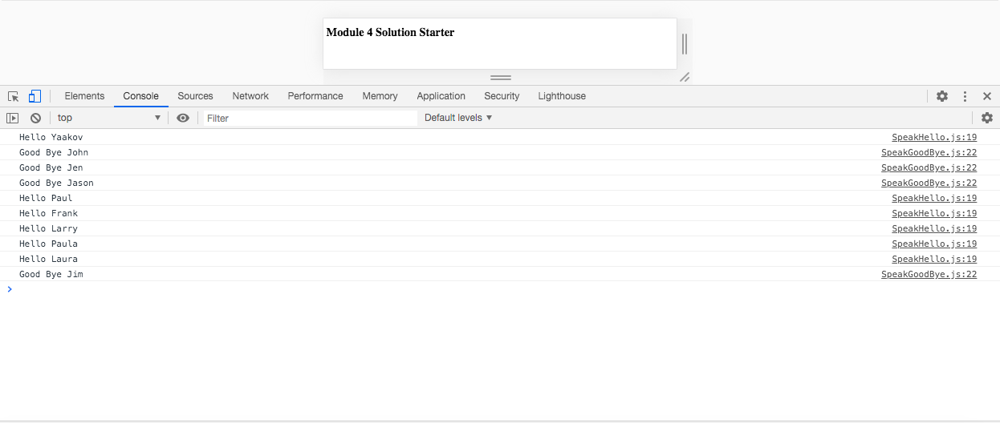

# JavaScript Debugging

This purpose of this application is to debug the given starter code so that the output appears correctly in the console.  This app takes an array of names and then outputs either Hello + "name" or Good Bye + "name" to the console. The console outputs "Good Bye" along with any name that begins with the letter "J", uppercase or lowercase.  The console also outputs "Hello", but only with names that do not begin with the letter "J".  The JS code contains the usual objects, variables, functions, for loops, and if/else statements along with some IIFE's.  This application primarily uses JavaScript along with HTML5.

Deployed: https://caseofbase18.github.io/module4-solution/

Image of Console
